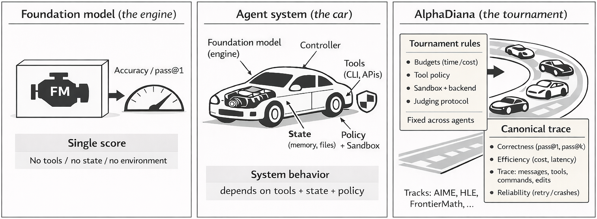

# AlphaDiana: A System for Evaluating Agentic Reasoning

**AlphaDiana** is an open-source framework for **system-level evaluation of LLM-based reasoning agents**. It enables standardized, reproducible benchmarking of agentic systems—such as **[OpenClaw](https://github.com/openclaw/openclaw)**—on frontier reasoning tasks, with support for sandboxed code execution, multi-turn tool use, and full trajectory logging.

<p align="center">
  
</p>
<p align="center">
  <em><strong>Figure 1.</strong> Why agentic reasoning requires system-level evaluation: foundation models are evaluated like engines, agents behave like cars shaped by tools and state, and AlphaDiana serves as the tournament organizer that standardizes evaluation and records canonical traces.</em>
</p>

## Why AlphaDiana?

Reasoning performance in agent systems depends on more than the base model alone. It is also shaped by the **agent framework, tool interface, execution environment, and evaluation protocol**.

AlphaDiana is designed for **fair, reproducible, and transparent** evaluation of agentic reasoning systems.

With AlphaDiana, you can:
- evaluate **OpenClaw-style reasoning agents**
- compare against a **direct LLM baseline**
- run evaluations with **sandboxed execution**
- benchmark on **AIME, MATH, and custom datasets**
- record and inspect **full execution traces**
- launch and compare runs through both **CLI and dashboard**

Typical questions AlphaDiana helps answer:
- How much does an agent improve over the base model?
- How well does it perform on a target benchmark?
- How much do tools and sandbox settings affect results?
- What failure modes appear in execution traces?

## Key Features

- **Standardized evaluation** for reproducible benchmarking of agentic reasoning systems  
- **OpenClaw support** for multi-turn reasoning with tool use and code execution  
- **ROCK sandbox integration** for safe, isolated execution  
- **Direct LLM baseline** for clean agent-vs-model comparison  
- **Built-in benchmarks** including AIME, MATH, and custom tasks  
- **Full trace logging** for debugging, inspection, and analysis  
- **Web dashboard** for launching, monitoring, and comparing runs  
- **Automatic sandbox management** with configurable concurrency

## Quick Start

### Prerequisites

- Linux
- Python >= 3.10, Conda
- Docker (the current user should be in the `docker` group)
- An API key for a model provider (e.g., [OpenRouter](https://openrouter.ai/))

### 1. Install

```bash
git clone https://github.com/tmlr-group/AlphaDiana
cd AlphaDiana

# One-click setup: creates conda env, installs all dependencies, starts services
bash scripts/quickstart.sh

# Note: If quickstart fails, or you want to reset the ports/RAY clusters, please run: bash scripts/cleanup_rock_ports.sh (USE WITH CAUTION!)

# Pull the reasoning image (OpenClaw pre-installed)
docker pull tmlrgroup/alphadiana:v1
```

> **Note:** You can also build it locally:
>
> ```bash
> docker build -t openclaw-reasoning:v1 -f openclaw_deploy/Dockerfile.patched .
> ```
>
> Then reference `openclaw-reasoning:v1` in your config's `rock_image` field instead of the base image.

### 2. Configure your model

Create a `.env` file in the project root with your model endpoint and set your api key:

```bash
touch .env
echo "OPENAI_BASE_URL=https://openrouter.ai/api/v1" >> .env
echo "OPENAI_API_KEY=<your-api-key>" >> .env
echo "OPENAI_MODEL_NAME=z-ai/glm-5" >> .env
```

### 3. Activate the environment

Run this **once per terminal** before using AlphaDiana. It handles conda activation, proxy cleanup, port loading, and API key loading automatically:

```bash
source scripts/activate.sh
```

### 4. Check that everything is working

```bash
alphadiana env
```

All four checks should pass:

```
  ✓ admin
  ✓ proxy
  ✓ redis
  ✓ docker
```

### 5. Run your first evaluation

```bash
alphadiana validate configs/examples/openclaw_aime2024.yaml
alphadiana run configs/examples/openclaw_aime2024.yaml
```

### 6. Generate a report

```bash
alphadiana report results/
```

For a full walkthrough, see [`docs/getting_started.md`](docs/getting_started.md).
For manual setup and troubleshooting, see [`docs/setup_detail.md`](docs/setup_detail.md).

## Configuration

AlphaDiana is configured with a YAML file. At a high level, you specify:

- the **agent**
- the **benchmark**
- the **scorer**
- the **runtime settings** such as concurrency and output directory

Example:

```yaml
run_id: "openclaw-glm-5-aime2024-001"

agent:
  name: openclaw
  config:
    rock_image: "openclaw-reasoning:v1"
    rock_agent_config_path: "openclaw_deploy/rock_agent_config.prebuilt.yaml"
    openclaw_config_path: "openclaw_deploy/openclaw.json"
    rock_memory: "4g"
    rock_cpus: 1
    system_prompt: You are an expert problem solver. ...

benchmark:
  name: aime
  config:
    dataset: "HuggingFaceH4/aime_2024"
    split: "train"

scorer:
  name: math_verify
  config:
    tolerance: 1e-6

max_concurrent: 1
output_dir: "./results"
```

Ready-to-run examples are provided in [`configs/examples/`](configs/examples/).

## Running Evaluations

### Run an OpenClaw agent

The recommended starting point is the **single-sandbox** configuration. In this mode, AlphaDiana automatically creates a ROCK sandbox, runs the evaluation, and removes the sandbox afterward.

```bash
alphadiana run configs/examples/openclaw_aime2024.yaml
```

This configuration uses one sandbox by default with `4g` memory and `1` CPU.

To increase parallelism, update:

```yaml
max_concurrent: 4
```

To run multiple sandboxes in parallel, increase `max_concurrent` in the config.

### Run a direct LLM baseline

You can also evaluate a model directly without agent orchestration:

```bash
alphadiana run configs/examples/direct_llm.yaml
```

This is useful for establishing a clean baseline before measuring the effect of an agent framework.

The bundled example reuses the `.env` values loaded by `source scripts/activate.sh`:

- `OPENAI_MODEL_NAME`
- `OPENAI_BASE_URL`
- `OPENAI_API_KEY`

If you want a different endpoint just for this baseline, override `model`, `api_base`, and
`api_key` directly in `configs/examples/direct_llm.yaml`.

See [`docs/getting_started.md`](docs/getting_started.md) for a complete example.

### Run a custom problem set

The `custom` benchmark lets you define problems directly in YAML, which is useful for debugging, ablation studies, or spot checks.

```yaml
run_id: "my-custom-run"

agent:
  name: openclaw
  config:
    # ... same agent config as above

benchmark:
  name: custom
  config:
    problems:
      - id: "problem_1"
        problem: "Find the number of ordered pairs (x,y) of positive integers satisfying x + y = 100 and x * y is divisible by 6."
        answer: "117"
      - id: "problem_2"
        problem: "What is the sum of all prime numbers less than 20?"
        answer: "77"

scorer:
  name: numeric
  config:
    tolerance: 1e-6

max_concurrent: 1
output_dir: "./results"
```

Any supported agent and scorer can be used with the `custom` benchmark.

## CLI Reference

| Command | Description |
|---|---|
| `alphadiana env` | Check service health before running |
| `alphadiana run <config.yaml>` | Run an evaluation |
| `alphadiana validate <config.yaml>` | Validate a config without running |
| `alphadiana report <results_dir>` | Generate reports from saved results |
| `alphadiana batch <config1> <config2> ...` | Run multiple experiments |
| `alphadiana list-benchmarks` | List all registered benchmarks |

Use `-o key=value` to override config values from the command line (e.g., `-o max_concurrent=4`).

## Evaluation Flow

```text
YAML Config
   │
   ▼
Runner
   │
   ├── Benchmark loader
   │      └── loads tasks
   │
   ├── Agent
   │      └── generates answers / tool calls
   │
   ├── Sandbox
   │      └── executes agent-generated code
   │
   └── Scorer
          └── verifies outputs

results/<run_id>.jsonl
   │
   ├── report generation
   └── dashboard visualization
```

## Results

We evaluate agentic reasoning on **AIME 2024, 2025, and 2026** using two backbone models: **Qwen2.5-14B-Instruct** and **GLM-5**. Each configuration is compared under a direct LLM baseline and the OpenClaw agent, with **avg@32** and **pass@32** as evaluation metrics (32 samples per problem).

**Qwen2.5-14B-Instruct**

| Benchmark | Avg@32 (Base) | Avg@32 (OpenClaw) | Pass@32 (Base) | Pass@32 (OpenClaw) |
|-----------|--------------|-------------------|---------------|-------------------|
| AIME 2024 | 0.1521 | 0.1271 | 0.4333 | 0.4000 |
| AIME 2025 | 0.1229 | 0.1469 | 0.4000 | 0.4333 |
| AIME 2026 | 0.1115 | 0.1250 | 0.4333 | 0.4333 |

**GLM-5**

| Benchmark | Avg@32 (Base) | Avg@32 (OpenClaw) | Pass@32 (Base) | Pass@32 (OpenClaw) |
|-----------|--------------|-------------------|---------------|-------------------|
| AIME 2024 | 0.9000 | 0.8300 | 0.9330 | 1.0000 |
| AIME 2025 | 0.6300 | 0.7600 | 0.9300 | 1.0000 |
| AIME 2026 | 0.5719 | 0.3896 | 0.9000 | 0.9667 |

## Project Structure

```
AlphaDiana/
├── alphadiana/                   # Core package
│   ├── cli.py                    # CLI entry point
│   ├── agent/                    # Agent implementations
│   │   ├── direct_llm.py         #   Direct LLM baseline (single-turn)
│   │   └── openclaw.py           #   OpenClaw agent (multi-turn + tools)
│   ├── benchmark/                # Benchmark loaders
│   │   ├── aime.py               #   AIME competition math
│   │   └── custom.py             #   User-defined inline problems
│   ├── scorer/                   # Answer scorers
│   │   ├── numeric.py            #   Numeric comparison
│   │   ├── exact_match.py        #   Exact string match
│   │   ├── math_verify_scorer.py #   Math-aware verification
│   │   └── llm_judge.py          #   LLM-as-judge
│   ├── runner/                   # Orchestration
│   ├── sandbox/                  # Sandbox backends (ROCK, local, etc.)
│   ├── results/                  # Result storage and reporting
│   ├── config/                   # Config parsing and validation
│   └── dashboard/                # Web UI (FastAPI + React)
├── configs/examples/             # Ready-made experiment configs
├── openclaw_deploy/              # OpenClaw deployment configs
├── scripts/                      # Setup and utility scripts
└── docs/                         # Documentation
```

## Dashboard

AlphaDiana includes a web dashboard for launching, monitoring, and comparing evaluation runs without manually editing YAML or inspecting raw JSONL files.


### Dashboard features

- browse run history
- compare multiple runs side by side
- launch evaluations through forms
- monitor job progress with real-time logs
- manage ROCK sandboxes

### Install dashboard dependencies

```bash
pip install -e '.[dashboard]'
cd alphadiana/dashboard/frontend
npm install && npm run build
cd ../../..
```

### Start the dashboard

```bash
source scripts/rock_env.sh
source scripts/.rock_ports.env

cd alphadiana/dashboard
./run.sh
```

For production mode:

```bash
./run.sh --prod
```

If the default port is already in use, `run.sh` automatically switches to the next available port.

For detailed instructions, see [`docs/dashboard.md`](docs/dashboard.md).

## Documentation

| Document | Description |
|---|---|
| [`docs/getting_started.md`](docs/getting_started.md) | End-to-end tutorial for a first evaluation run |
| [`docs/setup_detail.md`](docs/setup_detail.md) | Manual setup and troubleshooting |
| [`docs/dashboard.md`](docs/dashboard.md) | Dashboard usage guide |
| [`docs/push_docker_image.md`](docs/push_docker_image.md) | Docker image build, customize, and push guide |

## Acknowledgements

AlphaDiana is developed to support research on trustworthy agentic reasoning and reproducible evaluation of reasoning systems. We thank the contributors, collaborators, and open-source communities behind tools and systems that make this work possible, including [OpenClaw](https://github.com/openclaw/openclaw), [ROCK](https://github.com/alibaba/ROCK), and related infrastructure.

## Citation

If you use AlphaDiana in your research, please cite the project once the paper or technical report is available.

```bibtex
@misc{alphadiana,
  title={AlphaDiana: A System for Evaluating Agentic Reasoning},
  year={2026},
  url={https://github.com/tmlr-group/AlphaDiana}
}
```
